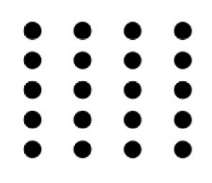
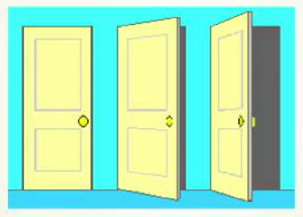

### Week 2 : Assignment

1. **Perception is highly objective.**

   - **False**
2. **There are many women at the bottom and middle level management roles but only a very few make it to the top. This is due to:**

   - Glass-ceiling effect
3. **The process of giving meaning to sensory stimuli through organizing and interpreting is called:**

   - Perception
4. **Which of the following is an internal factor that influences the principles of perceptual selection?**

   - Habit
5.  

   In the above picture, we tend to see columns of dots due to a perceptual grouping effect called:**

   - Proximity
6. 
   **

   In the above image, one can still perceive the opening door to be of a rectangle shape due to:**

   - Perceptual Constancy
7. **The process through which individuals attempt to determine the causes behind others’ behaviour is called attribution.**

   - **True**
8. **According to Kelley’s theory of causal attribution, the extent to which other people behave in the same manner as the person we are judging is called:**

   - Consensus
9. **The tendency to attribute others’ action to internal causes while largely ignoring external factors is called:**

   - Fundamental attribution error
10. **The word “Carpenter” immediately brings in to memory the image of a male individual rather than a female individual. This is an example of a job stereotype.**

    - **True**
